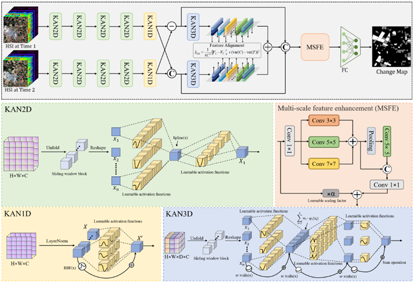

# SSTKAN
### 📖[**Paper**]

PyTorch codes for "Spectral-Spatial-Temporal Kolmogorov-Arnold Network for Hyperspectral Change Detection"


### 🌱 Abstract
>Hyperspectral change detection (HCD) aims to recognize altered areas between hyperspectral images captured at different times, which is one of the crucial research areas in remote sensing. In recent years, convolutional neural networks and transformers-based models have been popularly exploited for hyperspectral change detection. However, these models are based on the fixed-weight linear transformation, which struggle to effectively model the intricate spectral-spatial relationships inherent in hyperspectral images. Meanwhile, these methods usually neglect the feature distribution discrepancy induced by different environmental factors. To alleviate these issues, this paper proposes a novel spectral-spatial-temporal Kolmogorov-Arnold Network (SSTKAN) for hyperspectral change detection. First, a spectral-spatial Kolmogorov-Arnold Network is proposed to extract the spectral-spatial features from the input bitemporal hyperspectral images. Then, a 3D Kolmogorov-Arnold Network is exploited to extract the difference and temporal features. Next, a second-order statistical alignment method is proposed to reduce the feature distribution discrepancy of the same ground objects from bitemporal features. Finally, a multi-scale feature enhancement module is designed to strengthen the feature representation by aggregating information from multiple receptive fields followed by a fully connected layer to generate the final detection map. Experiments on four public hyperspectral datasets demonstrate that the proposed SSTKAN outperforms other advanced change detection approaches in both qualitative and quantitative results.
>

### Overall
<div align=center>

</div>

### Install
```
git clone https://github.com/wwx20031108-svg/SSTKAN.git
```

## 📃 Requirements
> * CUDA 13.1
> * Python 3.13.9
> * PyTorch 2.3.1
> * numpy 1.24.3
> * torchvision 0.15.2
> * scipy 1.9.1
> * matplotlib 3.7.2 

## 🧩 How to use it?
---------------------
`python demo.py --dataset='farmland'`


